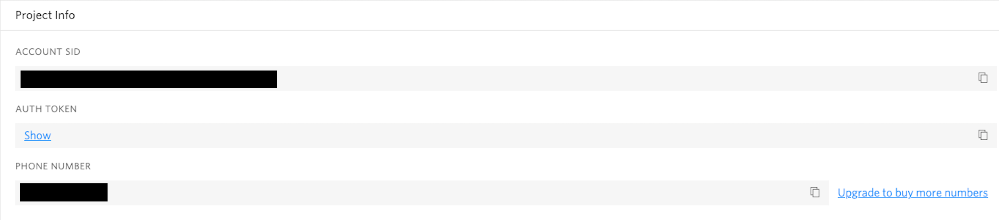
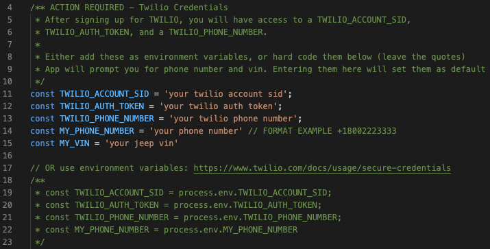

# My Jeep Status

## Description
A small Command Line Interface (CLI) application that checks if your Jeeps **Build Sheet** and **Sticker** have been found. When one is found, it will send you a text message notification. When both have been found the application terminates. 

## Notes
- A [Twilio](www.twilio.com/referral/bf6oIx) account is needed for sending text messages (Free! No card needed.)
- Some coding experience would be beneficial when running this CLI app

## Getting Started

**Note:** this README is directed towards Unix-based shell (e.g. mac, linux)

1. Clone, Fork, or Download this Repository
2. Make sure you have `node`and `npm` installed on your system. [Install Node.js/npm](https://docs.npmjs.com/downloading-and-installing-node-js-and-npm)

    Once you have those installed, check to make sure they are working by typing `node -v` and `npm -v` in the CLI. If versions show up, then you're ready for the next step.

    If no versions are present `source` or terminate the CLI and try again. Otherwise revisit [Install Node.js/npm](https://docs.npmjs.com/downloading-and-installing-node-js-and-npm)

3. Get a [Twilio](www.twilio.com/referral/bf6oIx) account if you dont already have one. This library allows us to send alerts, in this case text messages. A trial account will work fine as this app will only send a maximum of 4 text messages. (Trial account lets you send > 3500 texts).

    Once logged into Twilio, locate your account dashboard where you will find your `TWILIO_ACCOUNT_SID` and `TWILIO_AUTH_TOKEN`. Also on this page you will generate your `TWILIO_PHONE_NUMBER`.

    

4. Now lets use your Twilio account values in the **my-jeep-status** app. Navigate to the `check-my-jeep-status.js` file. Near the top you will see something that looks like this:

    

    Replace where it says `your ...` with your own Twilio account variables, and your phone number/vin.

5. Done! 

    To run the program open a shell (Terminal on mac) and navigate into the `check-my-jeep-status' folder and run the following commands.

    - `npm install`
    - `node check-my-jeep-status.js`

    The program should prompt you with 4 questions and once you answer and hit enter on all of them, you should recieve a text letting you know everything is working properly. 

## Tips
- You can change how frequently the program runs. Default: every hour.

## F.A.Q
1. Will this app spam my phone?
    - No. It will alert you a maximum of 4 times. Once to confirm you are recieving texts from the app. Once for build sheet. Another for sticker and finally one letting you know the app is complete.
2. Do I need to keep running the app?
    - No... and yes. The app will automatically check for updated build sheet and sticker every hour. This number can be changed on `line 26` of the `check-my-jeep-status.js` file. I would not go lower than 15-30 minutes. If your computer goes to sleep it might not work, and you might have to rerun it. This can be avoided if you run it on a server.
3. Can I star this Repository?
    - YES. Top right corner :)
